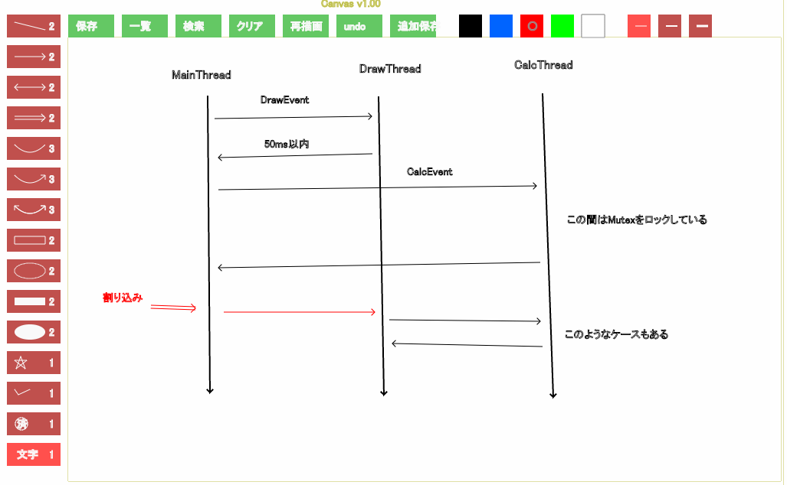
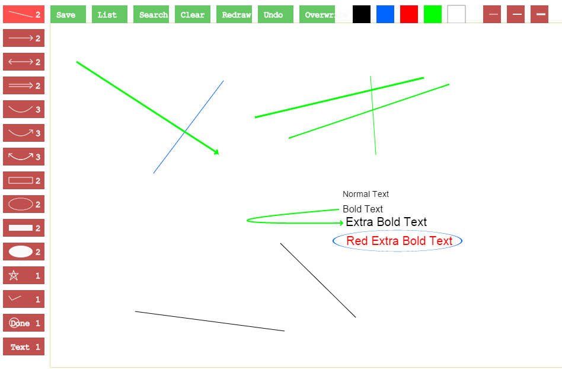
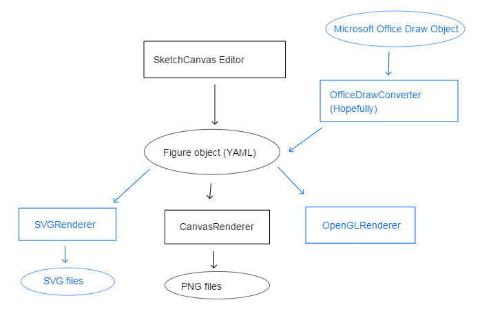
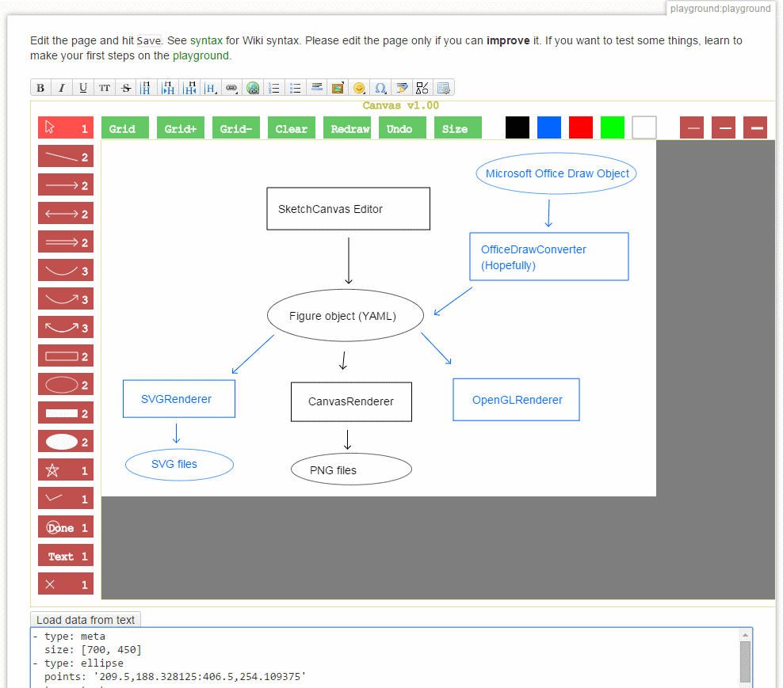
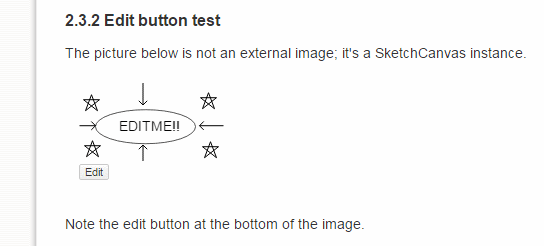
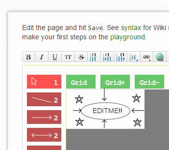
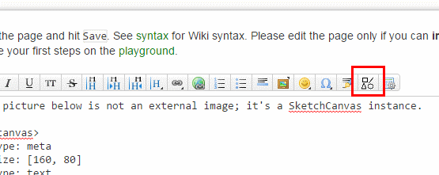

# SketchCanvas
A simple HTML5 figure editor and viewer

## Objectives

Create a simple figure format that can replace Microsoft Word figures in
web documents.

It aims to have following features:

* Easily editable in-place by GUI.
* Easily embeddable into Wiki pages, blogs and design documents.
* Can be easily copy & pasted to another document.
* Unlike SVG, no complex graphics features are supported
* Has a text format that is easily examined and edited by human.
* Can also be saved as a separate text file.
* Can be easily compared with text-wise diff.
* Has extensible format.

## Current implementation

Current implementation uses YAML as format.
It enables easy inspection and editing by humans.

It can be edited by a static HTML document with JavaScript.
It's so easy to setup a server that accepts and shows uploaded figures.

It's very easy to create a figure or a diagram like this one:

The source looks like this:

~~~ yaml
- type: line
  points: '485,569:233,536'
- type: line
  points: '605,546:478,421'
- type: line
  points: '382,147:264,303'
  color: blue
- type: line
  points: '630,139:639,272'
  color: green
- type: line
  points: '763,153:492,244'
  color: green
  width: 2
- type: line
  points: '720,142:435,209'
  color: green
  width: 3
- type: arrow
  points: '134,115:372,269'
  color: green
  width: 3
- type: text
  points: '583,343'
  text: Normal Text
- type: text
  points: '583,369'
  width: 2
  text: Bold Text
- type: text
  points: '588,392'
  width: 3
  text: Extra Bold Text
- type: text
  points: '589,424'
  color: red
  width: 3
  text: Red Extra Bold Text
- type: arcarrow
  points: '577,364:264,390:583,387'
  color: green
  width: 2
- type: ellipse
  points: '567,399:784,435'
  color: blue
  width: 2

~~~

# Roadmap

Blue areas are planned but not implemented yet.

# DokuWiki plugin

A DokuWiki plugin for rendering and editing SketchCanvas sketches is available.

https://www.dokuwiki.org/plugin:sketchcanvas

## Edit button

An included sketch looks like this:

Pressing the edit button brings you to the edit page.

## New Sketch button

When you want to add a new sketch into a document, press new sketch button
in the toolbar in edit mode.
You can also edit existing sketch in the edit page by selecting a whole
&lt;skcanvas&gt; tag and pressing the button.

